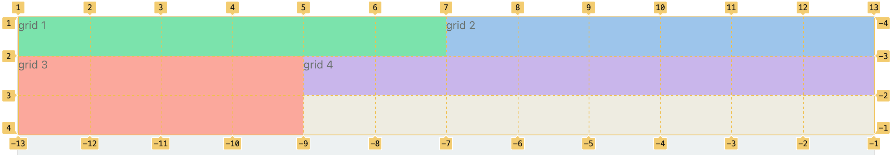

Grid 2D 是一种二维布局方式，它可以更直观设置组件位置。

> Grid 2D 布局不支持 IE11

## 基本用法

```schema: scope="body"
{
  "type": "grid-2d",
  "grids": [
    {
      "x": 1,
      "y": 1,
      "h": 1,
      "w": 6,
      "gridClassName": "bg-green-300",
      "type": "tpl",
      "tpl": "[grid-1] x:1 y:1 h:1 w:6"
    },
    {
      "x": 7,
      "y": 1,
      "h": 1,
      "w": 6,
      "gridClassName": "bg-blue-300",
      "type": "tpl",
      "tpl": "[grid-2] x:7 y:1 h:1 w:6"
    },
    {
      "x": 1,
      "y": 2,
      "h": 2,
      "w": 4,
      "gridClassName": "bg-red-300",
      "type": "tpl",
      "tpl": "[grid-3] x:1 y:2 h:2 w:4"
    },
    {
      "x": 5,
      "y": 2,
      "h": 1,
      "w": 8,
      "gridClassName": "bg-purple-300",
      "type": "tpl",
      "tpl": "[grid-4] x:5 y:2 h:1 w:8"
    }
  ]
}
```

## 布局基础

`grids` 中可以是任意组件，这里为了简化使用 tpl 组件，通过 x/y/h/w 这四个属性来控制格子的位置和大小。

首先看下图示例，它就是前面基本用法的示例加上标注：



默认水平方向会平分为 12 列，可以通过 `cols` 来调整，比如只分为 3 栏。

先看 `[grid-1]`，它的 `x/y/h/w` 值分别是 `1,1,1,6`：

- `x,y` 决定这个格子的位置，`1,1` 就是最左上角的位置，如图所示
- `w` 代表宽度占几格，因为水平方向一共 12 列，所以 6 就意味着占水平空间一半
- `h` 代表高度占几格，默认每行高度可以使用 `rowHeight` 来控制，也可以设置 `height` 来单独控制这一行的高度

其它格子也可以参照这张图推理出来，比如 `[grid-2]` 起始 x 位置是 `7`，宽度是 6，因此它和 `[grid-]` 平分了第一行。

## 独立设置高宽

在上面的例子中格子的宽度是根据页面宽度平分，高度是固定的，但我们也可以单独改变某一行或某一列的高宽，方法是格子上的 `width` 和 `height` 值。

看下面这个例子

```schema: scope="body"
{
  "type": "grid-2d",
  "cols": 3,
  "grids": [
    {
      "x": 1,
      "y": 1,
      "h": 1,
      "w": 1,
      "width": 100,
      "gridClassName": "bg-green-300",
      "type": "tpl",
      "tpl": "[grid-1] x:1 y:1 h:1 w:1"
    },
    {
      "x": 2,
      "y": 1,
      "h": 1,
      "w": 1,
      "height": 100,
      "gridClassName": "bg-blue-300",
      "type": "tpl",
      "tpl": "[grid-2] x:2 y:1 h:1 w:1"
    },
    {
      "x": 3,
      "y": 1,
      "h": 1,
      "w": 1,
      "width": 100,
      "gridClassName": "bg-red-300",
      "type": "tpl",
      "tpl": "[grid-3] x:3 y:1 h:1 w:1"
    },
    {
      "x": 2,
      "y": 2,
      "h": 1,
      "w": 1,
      "gridClassName": "bg-purple-300",
      "type": "tpl",
      "tpl": "[grid-4] x:2 y:2 h:1 w:1"
    }
  ]
}
```

在这个例子中，首先通过 `cols` 设置了列数为 `3`，然后将 `[grid-1]` 和 `[grid-3]` 的 width 设置为 `100`，使得这两列的宽度都是 100，而页面剩下的宽度就全都留给了 `[grid-2]`。

而在 `[grid-2]` 中通过 `height` 设置了高度，使得这一行高度是 `100px`，而不是默认的 `50px`。

请注意：`width` 将影响一整列，`height` 将影响一整行。

## 自适应内容高度

如果格子内容高度不确定，想更具内容自动撑开，可以设置 `height` 为 `auto`。

```schema: scope="body"
{
  "type": "grid-2d",
  "cols": 3,
  "grids": [
    {
      "x": 2,
      "y": 1,
      "h": 1,
      "w": 1,
      "height": "auto",
      "gridClassName": "bg-blue-300",
      "type": "tpl",
      "tpl": "1</br>2</br>3</br>4</br>5</br>6</br>"
    }
  ]
}
```

## 格子间距 gap / rowGap

通过 grip 上的 gap 属性来控制间距，默认包含水平和垂直间距

```schema: scope="body"
{
  "type": "grid-2d",
  "gap": 10,
  "gapRow": 5,
  "grids": [
    {
      "x": 1,
      "y": 1,
      "h": 1,
      "w": 6,
      "gridClassName": "bg-green-300",
      "type": "tpl",
      "tpl": "[grid-1] x:1 y:1 h:1 w:6"
    },
    {
      "x": 7,
      "y": 1,
      "h": 1,
      "w": 6,
      "gridClassName": "bg-blue-300",
      "type": "tpl",
      "tpl": "[grid-2] x:7 y:1 h:1 w:6"
    },
    {
      "x": 1,
      "y": 2,
      "h": 2,
      "w": 4,
      "gridClassName": "bg-red-300",
      "type": "tpl",
      "tpl": "[grid-3] x:1 y:2 h:2 w:4"
    },
    {
      "x": 5,
      "y": 2,
      "h": 1,
      "w": 8,
      "gridClassName": "bg-purple-300",
      "type": "tpl",
      "tpl": "[grid-4] x:5 y:2 h:1 w:8"
    }
  ]
}
```

## 内容区域小于格子的摆放

默认情况下，格子的高宽会撑满对应区域的高宽，但有时候内容高宽比这个格子小，比如一张图片，如何将它在各种中居中显示？

看下面的例子

```schema: scope="body"
{
  "type": "grid-2d",
  "cols": 3,
  "grids": [
    {
      "x": 1,
      "y": 1,
      "h": 1,
      "w": 1,
      "gridClassName": "bg-green-300",
      "type": "tpl",
      "tpl": "[grid-1] x:1 y:1 h:1 w:1"
    },
    {
      "x": 2,
      "y": 1,
      "h": 1,
      "w": 1,
      "align": "center",
      "valign": "middle",
      "gridClassName": "bg-blue-300",
      "type": "tpl",
      "tpl": "hello"
    },
    {
      "x": 3,
      "y": 1,
      "h": 1,
      "w": 1,
      "gridClassName": "bg-red-300",
      "type": "tpl",
      "tpl": "[grid-3] x:3 y:1 h:1 w:1"
    }
  ]
}
```

在中间的格子中，我们设置了 `"align": "center"` 和 `"valign": "middle"`，就使得文字水平和垂直居中显示了。

## 属性表

| 属性名          | 类型                                      | 默认值    | 说明                            |
| --------------- | ----------------------------------------- | --------- | ------------------------------- |
| type            | `string`                                  | `grid-2d` | 指定为 Grid 2D 渲染器           |
| gridClassName   | `string`                                  |           | 外层 Dom 的类名                 |
| gap             | `int`/`string`                            | 0         | 格子间距，包括水平和垂直        |
| cols            | `int`                                     | 12        | 格子水平划分为几个区域          |
| rowHeight       | `int`                                     | 50        | 每个格子默认垂直高度            |
| rowGap          | `int`/`string`                            |           | 格子垂直间距                    |
| grids           | `Array`                                   |           | 格子集合                        |
| grids[x]        | [SchemaNode](../../docs/types/schemanode) |           | 格子可以是其他渲染器            |
| grids[x].x      | `int`                                     |           | 格子起始位置的横坐标            |
| grids[x].y      | `int`                                     |           | 格子起始位置的纵坐标            |
| grids[x].w      | `int`                                     |           | 格子横跨几个宽度                |
| grids[x].h      | `int`                                     |           | 格子横跨几个高度                |
| grids[x].width  | `int`/`string`/`auto`                     |           | 格子所在列的宽度                |
| grids[x].height | `int`/`string`/`auto`                     |           | 格子所在行的高度，可以设置 auto |
| grids[x].align  | `left`/`center`/`right`/`auto`            | `auto`    | 格子内容水平布局                |
| grids[x].valign | `top`/`bottom`/`middle`/`auto`            | `auto`    | 格子内容垂直布局                |
