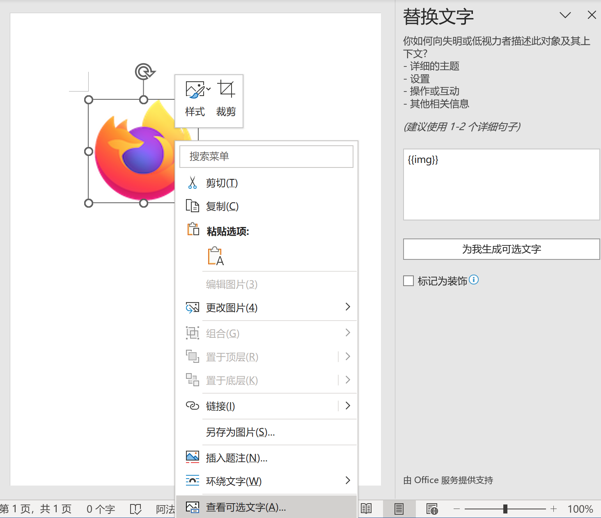

> 2.9.0 及以上版本

用于渲染 office 文档，目前只支持 docx 格式

## 基本用法

```schema: scope="body"
{
  "type": "office-viewer",
  "src": "/examples/static/simple.docx",
  "wordOptions": {
    "padding": "8px",
    "ignoreWidth": false
  }
}
```

## 渲染配置项

目前只支持 Word 文档，所以只有 word 的配置项，放在 `wordOptions` 下

Word 渲染支持以下功能：

- 基础文本样式
- 表格及表格样式
- 内嵌图片
- 列表
- 注音
- 链接
- 文本框
- 形状
- 数学公式（依赖 MathML，需要比较新的浏览器，或者试试 [polyfill](https://github.com/w3c/mathml-polyfills)）
- 分页渲染

不支持的功能：艺术字、域、对象、目录

### word 渲染配置属性表

```json
{
  "type": "office-viewer",
  "wordOptions": {
    "padding": "8px",
    "ignoreWidth": false
  }
}
```

| 属性名          | 类型      | 默认值        | 说明                                                       |
| --------------- | --------- | ------------- | ---------------------------------------------------------- |
| classPrefix     | `string`  | 'docx-viewer' | 渲染的 class 类前缀                                        |
| ignoreWidth     | `boolean` | false         | 忽略文档里的宽度设置，用于更好嵌入到页面里，但会减低还原度 |
| padding         | `string`  |               | 设置页面间距，忽略文档中的设置                             |
| bulletUseFont   | `boolean` | true          | 列表使用字体渲染，请参考下面的乱码说明                     |
| fontMapping     | `object`  |               | 字体映射，是个键值对，用于替换文档中的字体                 |
| forceLineHeight | `string`  |               | 设置段落行高，忽略文档中的设置                             |
| enableVar       | `boolean` | true          | 是否开启变量替换功能                                       |
| printOptions    | `object`  |               | 针对打印的特殊设置，可以覆盖其它所有设置项                 |

#### 分页渲染

> 2.10.0 及以上版本

默认情况下 word 文档渲染使用流式布局，这样能更好融入到已有页面中，但展现上会和原先的文档有较大差异，且不支持页眉页脚，如果希望能看起来更像桌面端的效果，可以通过 `page` 配置开启分页渲染

```schema: scope="body"
{
  "type": "office-viewer",
  "id": "office-viewer-page",
  "wordOptions": {
    "page": true
  },
  "src": "/examples/static/page.docx",
}
```

分页渲染的其它设置项

| 属性名             | 类型      | 默认值    | 说明                                       |
| ------------------ | --------- | --------- | ------------------------------------------ |
| page               | `boolean` | false     | 是否开启分页渲染                           |
| pageMarginBottom   | `number`  | 20        | 页面上下间距                               |
| pageBackground     | `string`  | '#FFF'    | 页面内背景色                               |
| pageShadow         | `boolean` | true      | 是否显示阴影                               |
| pageWrap           | `boolean` | true      | 是否显示页面包裹                           |
| pageWrapBackground | `string`  | '#ECECEC' | 页面包裹的背景色                           |
| zoom               | `number`  |           | 缩放比例，取值 0-1 之间                    |
| zoomFitWidth       | `boolean` | false     | 自适应宽度缩放，如果设置了 zoom 将不会生效 |

### 关于渲染效果差异

目前的实现难以保证和本地 Word 渲染完全一致，会遇到以下问题：

1. 字体大小不一致
1. 单元格宽度不一致，表格完全依赖浏览器渲染

如果追求完整效果打印，目前只能使用下载文件的方式用本地 Word 进行打印。

## 列表符号出现乱码问题

默认情况下列表左侧的符号使用字体渲染，这样能做到最接近 Word 渲染效果，但如果用户的系统中没有这些字体就会显示乱码，为了解决这个问题需要手动在 amis 渲染的页面里导入对应的字体，比如

```css
<style>
  @font-face {
    font-family: Wingdings;
    src: url(./static/font/wingding.ttf);
  }

  @font-face {
    font-family: Symbol;
    src: url(./static/font/symbol.ttf);
  }
</style>
```

目前已知会有 `Wingdings` 和 `Symbol` 两个字体，可能还有别的

如果不想嵌入这两个字体，就只能在前面的 `wordOptions` 里设置 `bulletUseFont: false`。

## 变量替换

文档可以预先定义变量，通过配置 `enableVar` 来开启这个功能，在实际渲染时根据上下文数据来渲染变量，比如

```schema: scope="body"
{
  "type": "form",
  "title": "",
  "mode": "inline",
  "wrapWithPanel": false,
  "body": [
    {
      "type": "input-text",
      "name": "name",
      "value": "amis",
      "label": "姓名"
    },
    {
      "type": "input-email",
      "name": "email",
      "label": "邮箱"
    },
    {
      "type": "input-text",
      "name": "phone",
      "label": "手机号"
    },
    {
      "type": "office-viewer",
      "id": "office-viewer",
      "src": "/examples/static/info.docx",
      "wordOptions": {
        "enableVar": true,
        "padding": "8px"
      }
    }
  ]
}
```

如果关闭将显示原始文档

```schema: scope="body"
{
  "type": "office-viewer",
  "id": "office-viewer",
  "src": "/examples/static/info.docx",
  "wordOptions": {
    "padding": "8px"
  }
}
```

### 变量说明

目前变量使用的写法是 `{{name}}`，其中 `name` 代表变量名，另外这里可以是 amis 表达式，比如前面示例的 `{{DATETOSTR(TODAY(), 'YYYY-MM-DD')}}`

**Word 经常会自作主张进行语法检查，生成无关的标签导致变量替换出错，解决办法是参考这个[文档](https://support.microsoft.com/zh-cn/office/%E5%9C%A8-word-%E4%B8%AD%E6%A3%80%E6%9F%A5%E8%AF%AD%E6%B3%95-%E6%8B%BC%E5%86%99%E7%AD%89-0f43bf32-ccde-40c5-b16a-c6a282c0d251?ui=zh-cn&rs=zh-cn&ad=cn)，将所有语法检查都忽略掉，也就是文档里不再有飘红的文字**

### 表格行循环

目前针对表格支持循环语法，下面例子中第一个是模板里的变量写法，循环以 `{{#xxx}}` 开头，`{{/}}` 结束（不过目前还不支持嵌套语法，所以这个结束符合可以省略）

```schema
{
  "type": "page",
  "body": [
    {
      "type": "office-viewer",
      "id": "office-viewer-table-list",
      "src": "/examples/static/table-list.docx",
      "wordOptions": {
        "padding": "8px"
      }
    },
    {
      "type": "service",
      "api": "/api/mock2/sample/mirror?json=%7B%22users%22%3A%5B%7B%22name%22%3A%22u1%22%2C%22age%22%3A10%2C%22img%22%3A%22https%3A%2F%2Fsuda.cdn.bcebos.com%2Fimages%2Famis%2Fai-fake-face.jpg%22%7D%2C%7B%22name%22%3A%22u2%22%2C%22age%22%3A11%7D%5D%7D",
      "body": [{
        "type": "office-viewer",
        "src": "/examples/static/table-list.docx",
        "wordOptions": {
          "padding": "8px",
          "enableVar": true,
          "ignoreWidth": true
        },
        "trackExpression": "${users}"
      }]
    },
    {
      "type": "action",
      "label": "下载文档",
      "onEvent": {
          "click": {
            "actions": [
              {
                "actionType": "saveAs",
                "componentId": "office-viewer-table-list"
              }
            ]
          }
        }
    },

  ]
}
```

循环的语法是以 `{{#name}}` 开始，`{{/}}` 结束，在这期间的变量会取循环内的值。

注意上面的例子用到了 `trackExpression`，默认情况下如果设置了 `enableVar`，每次上层数据变化都会重新渲染文档，如果文档较大可能会有性能问题，这时可以通过配置 `trackExpression` 来限制只有某个数据变化时才重新渲染。

### 图片中的变量

> 2.10 及以上版本

如果要将文档中的图片设置为变量，需要右键对应的图片，选择「查看可选文字」，然后填入类似 `{{img}}` 变量标识，在渲染时图片将替换为这个 `img` 变量的 url 地址



下面是示例

```schema: scope="body"
{
  "type": "form",
  "title": "",
  "wrapWithPanel": false,
  "body": [
    {
      "type": "input-text",
      "name": "img",
      "value": "https://suda.cdn.bcebos.com/amis/images/alice-macaw.jpg",
      "label": "图片地址"
    },
    {
      "type": "office-viewer",
      "id": "office-viewer",
      "src": "/examples/static/image-alt-var.docx",
      "wordOptions": {
        "enableVar": true,
        "padding": "8px"
      }
    }
  ]
}
```

## 不渲染模式

通过配置 `display: false` 可以让文档不渲染，虽然不渲染，但还是可以使用后面的下载及打印功能

## 下载文档

基于事件动作实现

```schema: scope="body"
[
  {
    "type": "action",
    "label": "下载文档",
    "onEvent": {
        "click": {
          "actions": [
            {
              "actionType": "saveAs",
              "componentId": "office-viewer-download"
            }
          ]
        }
      }
  },
  {
    "type": "office-viewer",
    "id": "office-viewer-download",
    "display": false,
    "src": "/examples/static/simple.docx"
  }
]
```

## 打印文档

基于事件动作实现

```schema: scope="body"
[
  {
    "type": "action",
    "label": "打印",
    "onEvent": {
        "click": {
          "actions": [
            {
              "actionType": "print",
              "componentId": "office-viewer-print"
            }
          ]
        }
      }
  },
  {
    "type": "office-viewer",
    "id": "office-viewer-print",
    "display": false,
    "src": "/examples/static/simple.docx"
  }
]
```

有个 `printOptions` 配置项可以用来自定义在打印时的配置，默认设置是：

```json
{
  "page": true,
  "pageWrap": false,
  "pageShadow": false,
  "pageMarginBottom": 0,
  "pageWrapPadding": undefined
}
```

## 配合文件上传实现预览功能

配置和 `input-file` 相同的 `name` 即可

```schema: scope="body"
{
  "type": "form",
  "title": "",
  "wrapWithPanel": false,
  "body": [
    {
      "type": "input-file",
      "name": "file",
      "label": "File",
      "asBlob": true,
      "accept": ".docx"
    },
    {
      "type": "office-viewer",
      "id": "office-viewer",
      "name": "file"
    }
  ]
}
```

## 是否显示 loading

通过 `"loading": true` 配置显示 loading，主要用于网络较慢的场景。

## 属性表

| 属性名      | 类型      | 默认值 | 说明                  |
| ----------- | --------- | ------ | --------------------- |
| src         | Api       |        | 文档地址              |
| loading     | `boolean` | false  | 是否显示 loading 图标 |
| enableVar   | `boolean` |        | 是否开启变量替换功能  |
| wordOptions | `object`  |        | Word 渲染配置         |

## 动作表

当前组件对外暴露以下特性动作，其他组件可以通过指定`actionType: 动作名称`、`componentId: 该组件id`来触发这些动作，动作配置可以通过`args: {动作配置项名称: xxx}`来配置具体的参数，详细请查看[事件动作](../../docs/concepts/event-action#触发其他组件的动作)。

| 动作名称 | 动作配置               | 说明     |
| -------- | ---------------------- | -------- |
| saveAs   | `name?: string` 文件名 | 下载文档 |
| print    | -                      | 打印文档 |
