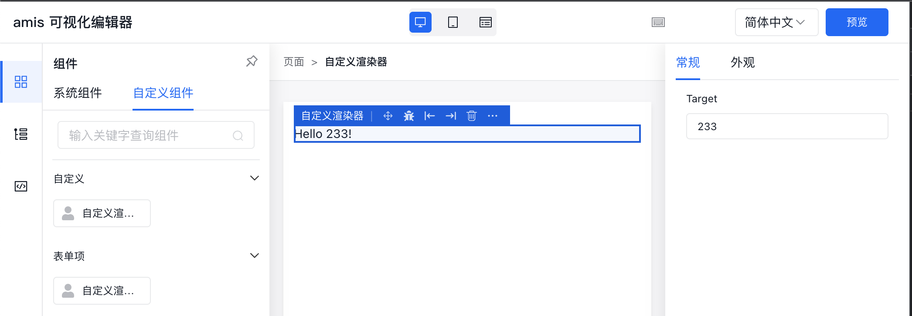
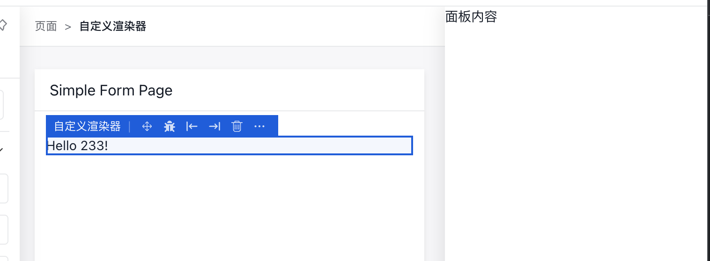
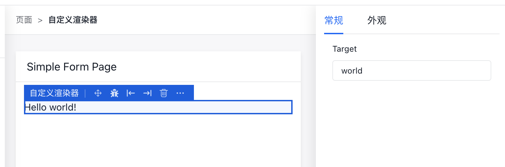
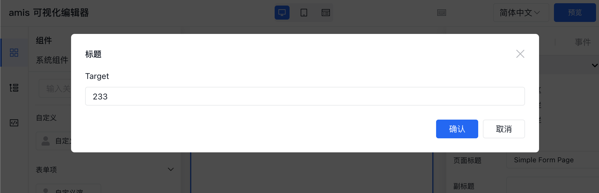
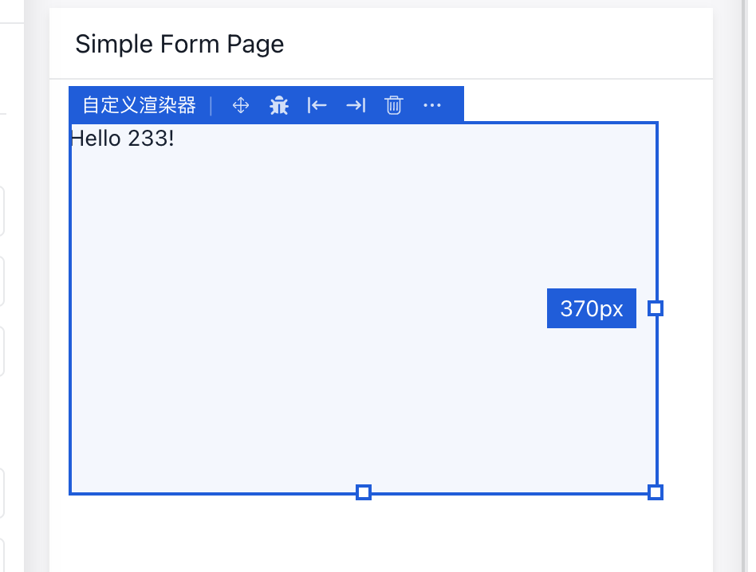
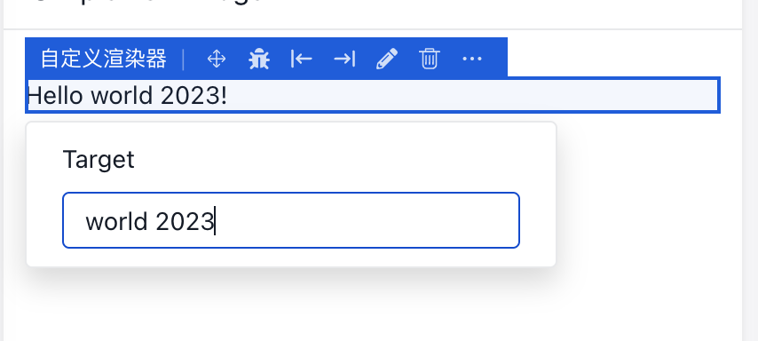

目前 amis 可视化编辑器也作为单独的 npm 包发布了出来，可以通过 npm 安装使用。

在线体验：https://aisuda.github.io/amis-editor-demo
示例代码：https://github.com/aisuda/amis-editor-demo

## 使用

目前有两个 npm 包：`amis-editor` 和 `amis-editor-core`。

- `amis-editor-core` 包含了少量底层必要的功能实现，里面没有包含 amis 内置渲染器插件的任何实现。
- `amis-editor` 基于 `amis-editor-core` 实现了 amis 内置的所有渲染器的可视化编辑器插件。

如果你没有使用 amis 内置渲染器，推荐只使用 `amis-editor-core`，否则推荐使用 `amis-editor`。这里主要介绍 `amis-editor`, `amis-editor-core` 的使用方式是一样的。

```
npm i amis-editor
```

通过 `npm` 安装完后，在 React 项目中这样使用：

```jsx
import {Editor} from 'amis-editor';


render() {
  return (
    <Editor
      {...props}
    />
  )
}
```

## 属性说明

- `value: Schema` amis json 配置，比如：`{type: 'page', body: 'contents...'}`
- `onChange: (value: Schema) => void` 当编辑器修改的时候会触发。
- `preview?: boolean` 是否为预览模式。
- `autoFocus?: boolean` 是否自动聚焦第一个可编辑的组件。
- `isMobile?: boolean` 是否为移动端模式，当为移动模式时，将采用 iframe 来预览。
- `$schemaUrl?: string` 提供 amis 产出的 schema.json 的访问路径。主要用来给代码编辑模式提供属性提示信息。
- `className?: string` 额外加个 css 类名，辅助样式定义。
- `schemas?: JSONSchemaObject` 用来定义有哪些全局变量，辅助编辑器格式化绑定全局数据。
- `theme?: string` amis 主题
- `schemaFilter?: (schema: any, isPreview?: boolean) => any` 配置过滤器。可以用来实现 api proxy，比如原始配置中请求地址是 `http://baidu.com` 如果直接给编辑器预览请求，很可能会报跨域，可以自动转成 `/api/proxy?_url=xxxx`，走 proxy 解决。
- `amisEnv?: any` 这是是给 amis 的 Env 对象，具体请前往 [env 说明](../start/getting-started#env)
- `disableBultinPlugin?: boolean` 是否禁用内置插件
- `disablePluginList?: Array<string> | (id: string, plugin: PluginClass) => boolean` 禁用插件列表
- `plugins?: Array<PluginClass>` 额外的自定义插件，具体看下面的说明。
- `isHiddenProps?: (key: string) => boolean` 是否为隐藏属性，隐藏属性是在配置中有，但是在代码编辑器中不可见。
- `actionOptions?: any` 事件动作面板相关配置
- `onInit?: ( event: PluginEvent<EventContext & {data: EditorManager;}>) => void` 初始化事件
- `onActive?: (event: PluginEvent<ActiveEventContext>) => void` 点选事件
- `beforeInsert?: (event: PluginEvent<InsertEventContext>) => false | void` 插入节点前事件
- `afterInsert?: (event: PluginEvent<InsertEventContext>) => void;` 插入节点后事件
- `beforeUpdate?: (event: PluginEvent<ChangeEventContext>) => false | void;` 面板里面编辑修改前的事件。可通过 event.preventDefault() 阻止。
- `afterUpdate?: (event: PluginEvent<ChangeEventContext>) => false | void;` 面板里面编辑修改后的事件。
- `beforeReplace?: (event: PluginEvent<ReplaceEventContext>) => false | void;` 更新渲染器前的事件，或者右键粘贴配置。可通过 event.preventDefault() 阻止。
- `afterReplace?: (event: PluginEvent<ReplaceEventContext>) => void` 更新渲染器后的事件，或者右键粘贴配置。
- `beforeMove?: (event: PluginEvent<MoveEventContext>) => false | void` 移动节点前触发，包括上移，下移。可通过 event.preventDefault() 阻止。
- `afterMove?: (event: PluginEvent<MoveEventContext>) => void` 移动节点后触发，包括上移，下移。
- `beforeDelete?: (event: PluginEvent<DeleteEventContext>) => false | void` 删除前触发。可通过 event.preventDefault() 阻止。
- `afterDelete?: (event: PluginEvent<DeleteEventContext>) => void` 删除后触发
- `beforeResolveEditorInfo?: ( event: PluginEvent<RendererInfoResolveEventContext> ) => false | void` 收集渲染器信息前触发。可通过 event.preventDefault() 阻止，如果阻止了，则目标组件不可编辑。
- `afterResolveEditorInfo?: ( event: PluginEvent<RendererInfoResolveEventContext> ) => void` 收集渲染器信息后触发
- `beforeResolveJsonSchema?: ( event: PluginEvent<RendererJSONSchemaResolveEventContext> ) => false | void` 基于渲染器获取配置的 jsonSchema 信息。可通过 event.preventDefault() 阻止。
- `afterResolveJsonSchema?: ( event: PluginEvent<RendererJSONSchemaResolveEventContext> ) => void` 基于渲染器获取配置的 jsonSchema 信息。
- `onDndAccept?: (event: PluginEvent<DragEventContext>) => false | void` 当将组件拖入某个容器时触发，用来决定接收不接收本次拖拽。
- `onBuildPanels?: (event: PluginEvent<BuildPanelEventContext>) => void` 构建右侧面板的事件，可以干预右侧面板的生成，可以新增面板。
- `onBuildContextMenus?: (event: PluginEvent<ContextMenuEventContext>) => void` 构建上下文菜单的事件
- `onBuildToolbars?: (event: PluginEvent<BaseEventContext>) => void` 构建点选框顶部 icon 按钮事件
- `onSelectionChange?: (event: PluginEvent<SelectionEventContext>) => void` 当点选发生变化的事件
- `onPreventClick?: ( event: PluginEvent<PreventClickEventContext> ) => false | void` 禁用内部点击事件的事件，可以用来控制是否禁用编辑态内置组件的一些点选能力。
- `onWidthChangeStart?: ` 当渲染器标记为 `widthMutable` 时会触发宽度变动事件
- `onHeightChangeStart?: ` 当渲染器标记为 `heightMutable` 时会触发宽度变动事件
- `onSizeChangeStart?: ` 当渲染器同时标记为 `widthMutable` 和 `heightMutable` 时会触发变动事件

## 自定义插件

开始之前，需要先自定义一个 amis 渲染器，然后再添加编辑器插件，让这个自定义渲染器可以在编辑器中可编辑。

```jsx
import React from 'react';
import {Renderer} from 'amis';

@Renderer({
  type: 'my-renderer',
  name: 'my-renderer'
})
export default class MyRenderer extends React.Component<MyRendererProps> {
  static defaultProps = {
    target: 'world'
  };

  render() {
    const {target} = this.props;

    return <p>Hello {target}!</p>;
  }
}
```

通过以上代码，amis 配置中通过 `type` 指定为 `my-renderer` 即可启用此组件。

接下来添加编辑器插件，添加插件的方式有两种。

- registerEditorPlugin 注册全局插件。
- 不注册，调用 <Editor> 的时候时候通过 plugins 属性传入。

效果都一样，重点还是怎么写个 Plugin，示例：

```jsx
import {BasePlugin} from 'amis-editor';

export class MyRendererPlugin extends BasePlugin {
  // 这里要跟对应的渲染器名字对应上
  // 注册渲染器的时候会要求指定渲染器名字
  rendererName = 'my-renderer';

  // 暂时只支持这个，配置后会开启代码编辑器
  $schema = '/schemas/UnkownSchema.json';

  // 用来配置名称和描述
  name = '自定义渲染器';
  description = '这只是个示例';

  // tag，决定会在哪个 tab 下面显示的
  tags = ['自定义', '表单项'];

  // 图标
  icon = 'fa fa-user';

  // 用来生成预览图的
  previewSchema = {
    type: 'my-renderer',
    target: 'demo'
  };

  // 拖入组件里面时的初始数据
  scaffold = {
    type: 'my-renderer',
    target: '233'
  };

  // 右侧面板相关
  panelTitle = '自定义组件';
  panelBody = [
    {
      type: 'tabs',
      tabsMode: 'line',
      className: 'm-t-n-xs',
      contentClassName: 'no-border p-l-none p-r-none',
      tabs: [
        {
          title: '常规',
          body: [
            {
              name: 'target',
              label: 'Target',
              type: 'input-text'
            }
          ]
        },

        {
          title: '外观',
          body: []
        }
      ]
    }
  ];
}
```

定义好 plugin 后，可以有两种方式启用。

```jsx
// 方式 1，注册默认插件，所有编辑器实例都会自动实例话。
import {registerEditorPlugin} from 'amis-editor';

registerEditorPlugin(MyRendererPlugin);

// 方式2，只让某些编辑器启用
() => <Editor plugins={[MyRendererPlugin]} />;
```



## 工作原理

编辑器在渲染 amis 配置的时候，会把所有的 json（配置） 节点都自动加个 `$$id` 唯一 id。然后复写了 `rendererResolver` 方法。某个节点 {type: 'xxxx'} 在找到对应 amis 组件渲染前，都会调用这个方法。
这个方法会在渲染之前，基于 schema、渲染器信息，通过插件去收集编辑器信息，如果收集到了，会额外的通过一个 `Wrapper` 包裹。这个 `Wrapper` 主要是自动把 `$$id` 写入到 dom 的属性上`data-editor-id="$$id"`。这样鼠标点击的时候，能够根据 dom 上的标记知道是哪个 json 节点，同时根据渲染器编辑器信息，能够生成对应的配置面板，并把对应 json 的节点做配置修改。

有些组件是带区域的，所以除了 dom 上标记节点信息外，还需要标记区域信息。节点能够通过 `Wrapper` 自动包裹来实现，但是区域则不能，这个要去分析组件本身是怎么实现。最终目的是要通过 `RegionWrapper` 去包裹对应 JSX.Element 来完成标记。这个 `RegionWrapper` 会自动完成 dom 的标记 `data-region="xxx" data-region-host="$$id"`，这样点击到这个 dom 的时候，能知道是哪个组件的哪个区域，这样就能往里面拖入新组件。

左侧的组件列表主要是将收集到的渲染器编辑器信息做个汇总展示，可拖入到指定区域内。

## 注册渲染器信息

如果想要渲染器在编辑器里面可点选，必须有插件提供这个渲染器的信息，这样才会被 `Wrapper` 包裹，才会在对应的 dom 上带上标记，才能点选。

在插件中可以通过实现 `getRendererInfo` 方法来注册渲染器信息，如果某个插件设置了 `rendererName` 和 `name` 属性，同时它继承 `BasePlugin` 的，则会自动完成注册逻辑。

```ts
/**
* 如果配置里面有 rendererName 自动返回渲染器信息。
* @param renderer
*/
getRendererInfo({
renderer,
schema
}: RendererInfoResolveEventContext): BasicRendererInfo | void {
  const plugin: PluginInterface = this;

  if (
    schema.$$id &&
    plugin.name &&
    plugin.rendererName &&
    plugin.rendererName === renderer.name // renderer.name 会从 renderer.type 中取值
  ) {
    let curPluginName = plugin.name;
    // 复制部分信息出去
    return {
      name: curPluginName,
      regions: plugin.regions,
      patchContainers: plugin.patchContainers,
      // wrapper: plugin.wrapper,
      vRendererConfig: plugin.vRendererConfig,
      wrapperProps: plugin.wrapperProps,
      wrapperResolve: plugin.wrapperResolve,
      filterProps: plugin.filterProps,
      $schema: plugin.$schema,
      renderRenderer: plugin.renderRenderer,
      multifactor: plugin.multifactor,
      scaffoldForm: plugin.scaffoldForm,
      disabledRendererPlugin: plugin.disabledRendererPlugin,
      isBaseComponent: plugin.isBaseComponent,
      rendererName: plugin.rendererName
    };
  }
}
```

`RendererInfoResolveEventContext` 主要包含以下信息：

- `schema` 渲染器的配置
- `schemaPath` 渲染器在整个配置中的路径信息
- `renderer` 渲染器信息，即注册 amis 渲染器的时候注册的渲染器信息

插件中可以基于这些信息来决定要不要注册编辑器插件，如果注册了则此渲染器可在编辑器中点选。可注册的信息主要包含：

- `name: string` 渲染器名字，决定点选高亮框的名称显示
- `searchKeywords?: string` 组件关键字，用来辅助组件列表搜索
- `description?: string` 在组件列表中展示有用
- `docLink?: string` 组件文档链接
- `previewSchema?: any` 用来生成预览图
- `tags ?:string | Array<string>` 分类, 决定会在哪个 tab 下面显示的
- `scaffold ?: any` 在编辑器中拖入该组件时生成的默认配置项
- `scaffolds ?: Array<any>` 脚手架也可以是多个，比如 Grid 组件，两栏，三栏组件都是用 grid 构建的，只是拖入时的初始配置不一样。
- `$schema?: string` json schema 定义。如： `/schemas/UnkownSchema.json` 目前这个不支持自定义，只有内置渲染器才有这些信息。
- `isBaseComponent?: boolean` 是否为内置渲染器，决定组建列表出现在内置 tab 下还是自定义 tab 下。
- `disabledRendererPlugin?: boolean` 新增属性，用于判断是否出现在组件面板中，默认为 false，为 true 则不展示
- `regions?: Array<RegionConfig>` 定义这个组件一共有哪些区域，比如页面组件包含的区域有：aside、body、toolbar 等。
- `patchContainers?: Array<string>` 哪些容器属性需要自动转成数组的。如果不配置默认就从 regions 里面读取。
- `overrides?: { [propName: string]: Function;}` 用来复写渲染器原型链上的方法，通常不需要这个。下面单独的篇章介绍
- `vRendererConfig?: VRendererConfig` 虚拟渲染器的配置项，有时候需要给那些并不是渲染器的组件添加点选编辑功能。 比如： Tabs 下面的 Tab, 这个并不是个渲染器，但是需要可以点选修改内容。
- `wrapperResolve?: (dom: HTMLElement) => HTMLElement | Array<HTMLElement>` 返回哪些 dom 节点，需要自动加上 data-editor-id 属性， 目前只有 TableCell 里面用到了，就它需要同时给某一列下所有 td 都加上那个属性。
- `wrapperProps?: Record<string, any>` 默认下发哪些属性，如果要动态下发，请使用 filterProps, 比如，table 渲染器，默认下发 resizeable: false, 这样编辑的时候就不会出现列的宽度可调整功能。这个是运行态的功能，不应该出现在编辑态里面。
- `filterProps?: (props: any, node: EditorNodeType) => Record<string, any>` 修改一些属性，一般用来干掉 $$id，或者渲染假数据, 这样它的孩子节点就不能直接点选编辑了，比如 Combo。
- `renderRenderer?: (props: any, info: RendererInfo) => JSX.Element` 有些没有视图的组件，可以自己输出点内容，否则没办法点选编辑。
- `multifactor?: boolean` 是否有多重身份？比如 CRUD 即是 CRUD 又可能是 Table，表格的列，即是表格列，也可能是其他文本框。 配置了这个后会自动添加多个 Panel 面板来编辑。
- `scaffoldForm?: ScaffoldForm` 右键的时候是否出现重新构建，靠这个。同时首次新增此渲染器的时候会出现一个脚手架弹窗。下面会有单独内容介绍。

## 如何定义右侧配置面板

当点选某个组件的时候，编辑器内部会触发面板构建动作，每个插件都可以通过实现 `buildEditorPanel` 来插入右侧面板。

```tsx
/**
 * 配置了 panelControls 自动生成配置面板
 * @param context
 * @param panels
 */
buildEditorPanel(
  context: BuildPanelEventContext,
  panels: Array<BasicPanelItem>
) {

  panels.push({
    key: 'xxxx',
    title: '设置',
    render: () => {
      return <div>面板内容</div>
    }
  })
}
```



通常右侧面板都是表单配置，使用 amis 配置就可以完成。所以推荐的做法是，直接在这个插件上面定义 `panelBody` 或者 `panelBodyCreator` 即可。

```js
panelBody = [
  {
    type: 'tabs',
    tabsMode: 'line',
    className: 'm-t-n-xs',
    contentClassName: 'no-border p-l-none p-r-none',
    tabs: [
      {
        title: '常规',
        body: [
          {
            name: 'target',
            label: 'Target',
            type: 'input-text'
          }
        ]
      },

      {
        title: '外观',
        body: []
      }
    ]
  }
];
```



`panelBodyCreator` 相对于 `panelBody` 的区别是，可以基于一些上下文信息来构建不同的表单。比如在表单里面的按钮，和在表单外面的按钮配置项不一样。

```js
panelBodyCreator = context => {
  console.log(context);
  return [
    {
      type: 'tabs',
      tabsMode: 'line',
      className: 'm-t-n-xs',
      contentClassName: 'no-border p-l-none p-r-none',
      tabs: [
        {
          title: '常规',
          body: [
            {
              name: 'target',
              label: 'Target',
              type: 'input-text'
            }
          ]
        },

        {
          title: '外观',
          body: []
        }
      ]
    }
  ];
};
```

`context` 中主要包含：

- `selections` 当前选中的渲染器，可能是多个
- `node` 节点信息
- `schema` 当前组件配置
- `info` 注册的渲染器编辑器信息

## 如何扩充渲染器容器配置

开始之前请先阅读 [工作原理](#工作原理)，如果是容器组件，还需要在对应 React 虚拟 dom 前包裹 `RegionWrapper`, 来完成 dom 标记。如果在注册编辑器信息的时候定义了 `regions` 信息，则会根据这个信息，自动完成 `RegionWrapper` 包裹。

这里先看简单的情况，比如 `container` 组件。它在 amis 大概是这样实现的容器功能。通过 `this.props.render('body', schema)` 来实现的容器功能。

```tsx
renderBody(): JSX.Element | null {
  const {
    children,
    body,
    render,
    classnames: cx,
    bodyClassName,
    disabled
  } = this.props;

  return (
    <div className={cx('Container-body', bodyClassName)}>
      {(render('body', body as any, {disabled}) as JSX.Element)}
    </div>
  );
}
```

在插件中像这样定义 `regions` 即可使得 `container` 有了 `body` 这个 region。

```ts
regions: Array<RegionConfig> = [
  {
    key: 'body',
    label: '内容区'
  }
];
```

插件内部会根据这个信息，自动在 `render('body', body as any, {disabled})` 的地方包裹个 `RegionWrapper`。这种方式主要是通过篡改 `this.props.render` 方法实现的。

再看个复杂点的情况如 `Form` 的 `actions` 区块输出。

```tsx
renderFooter() {
  const actions = this.buildActions();

  if (!actions || !actions.length) {
    return null;
  }

  const {
    store,
    render,
    classnames: cx,
    showErrorMsg,
    showLoading,
    show
  } = this.props;

  return (
    <div className={cx('Modal-footer')}>
      {(showLoading !== false && store.loading) ||
      (showErrorMsg !== false && store.error) ? (
        <div className={cx('Dialog-info')} key="info">
          {showLoading !== false ? (
            <Spinner size="sm" key="info" show={store.loading} />
          ) : null}
          {store.error && showErrorMsg !== false ? (
            <span className={cx('Dialog-error')}>{store.msg}</span>
          ) : null}
        </div>
      ) : null}
      {actions.map((action, key) =>
        render(`action/${key}`, action, {
          data: store.formData,
          onAction: this.handleAction,
          key,
          disabled: action.disabled || store.loading || !show
        })
      )}
    </div>
  );
}
```

像这个区域，它应该包裹在 `.Modal-footer` 里面，没办法通过第一种方式实现。所以第二种配置方式是：

```ts
regions: Array<RegionConfig> = [
  {
    key: 'actions',
    label: '按钮组',
    renderMethod: 'renderFooter',
    wrapperResolve: dom => dom
  }
];
```

通过 `renderMethod` 信息，去篡改渲染器（React Component）的原型链，在这个方法里面自动包裹 `RegionWrapper`。包裹也有多种策略，有时候要包裹在外面，有时要包裹在第一个虚拟 dom 里面。

更多配置信息请参考以下 `RegionConfig` 信息

- `key: string` 简单情况，如果区域直接用的 render('region', subSchema)，这种只需要配置 key 就能简单插入 Region 节点。
- `label: string` 区域用来显示的名字。
- `placeholder?: string` 区域占位字符，用于提示
- `matchRegion?: (elem: JSX.Element | undefined | null, component: JSX.Element ) => boolean` 对于复杂的控件需要用到这个配置。如果配置了，则遍历 react dom 直到目标节点调换成 Region 节点，如果没有配置这个，但是又配置了 renderMethod 方法，那就直接将 renderMethod 里面返回的 react dom 直接包一层 Region
- `renderMethod?: string` 指定要覆盖哪个方法。
- `rendererName?: string` 通常是 hack 当前渲染器，但有时候当前渲染器其实是组合的别的渲染器。如果要篡改别的渲染器，则通过渲染器名字指定。
- `insertPosition?: 'outter' | 'inner'` 当配置 renderMethod 的时候会自动把 Region 插入进去。 默认是 outter 模式，有时候可能需要配置成 inner， 比如 renderMethod 为 render 的时候。
- `optional?: boolean` 是否为可选容器，如果是可选容器，不会强制自动创建成员
- `renderMethodOverride?: (regions: Array<RegionConfig>, insertRegion: (component: JSX.Element, dom: JSX.Element, regions: Array<RegionConfig>, info: RendererInfo, manager: EditorManager) => JSX.Element ) => Function` 有时候有些包括是需要其他条件的，所以要自己写包裹逻辑。比如 Panel 里面的 renderBody
- `wrapper?: React.ComponentType<RegionWrapperProps>` 用来指定用什么组件包裹，默认是 RegionWrapper
- `wrapperResolve?: (dom: HTMLElement) => HTMLElement` 返回需要添加 data-region 的 dom 节点。
- `modifyGhost?: (ghost: HTMLElement, schema?: any) => void` 当拖入到这个容器时，是否需要修改一下 ghost 结构？
- `dndMode?: string` dnd 拖拽模式。比如 table 那种需要配置成 position-h
- `accept?: (json: any) => boolean` 可以用来判断是否允许拖入当前节点。

## 如何定义编辑器脚手架

如果希望拖入组件的时候，弹出个配置框，基于用户不同的配置，生成不同的初始数据。则这里需要用到 `scaffoldForm` 配置。

```tsx
scaffoldForm = {
  title: '标题',
  body: [
    {
      name: 'target',
      label: 'Target',
      type: 'input-text'
    }
  ]
};
```



可用配置

- `title` 脚手架框的标题
- `body` 表单项配置，参考 amis 的 form 配置
- `mode` 表单默认展示方式，参考 amis 的 form 配置
- `size` 弹窗大小，参考 amis 的 dialog 配置
- `initApi` 初始化接口
- `api` 提交接口
- `validate` 整体验证钩子
- `pipeIn?: (value: any) => any` schema 配置转脚手架配置
- `pipeOut?: (value: any) => any` 脚手架配置转 schema 配置
- `canRebuild?: boolean` 是否允许重新构建

## 如何构建点选框顶部菜单

插件中定义 `buildEditorToolbar` 方法即可添加点选框顶部菜单

```tsx
buildEditorToolbar(context: BaseEventContext, toolbars: Array<BasicToolbarItem>) {
  toolbars.push({
    iconSvg: 'left-arrow-to-left',
    tooltip: '向前插入组件',
    // level: 'special',
    placement: 'bottom',
    // placement: vertical ? 'bottom' : 'right',
    // className: vertical
    //   ? 'ae-InsertBefore is-vertical'
    //   : 'ae-InsertBefore',
    onClick: () =>
      this.manager.showInsertPanel(
        regionNode.region,
        regionNode.id,
        regionNode.preferTag,
        'insert',
        undefined,
        id
      )
  });
}
```

## 如何构建上下文功能菜单

插件中定义 `buildEditorContextMenu` 方法即可添加上下文功能菜单

```tsx
buildEditorContextMenu(
    {id, schema, region, selections}: ContextMenuEventContext,
    menus: Array<ContextMenuItem>
  ) {
    menus.push({
      label: '重复一份',
      icon: 'copy-icon',
      disabled: selections.some(item => !item.node.duplicatable),
      onSelect: () => manager.duplicate(selections.map(item => item.id))
    });
}
```

## 如何让渲染器可通过拖拽调整宽高

首先组件需要支持宽高设置，为了演示效果，将之前的 `my-renderer` 改成如下代码：

```tsx
@Renderer({
  type: 'my-renderer',
  name: 'my-renderer'
})
export class MyRenderer extends React.Component {
  static defaultProps = {
    target: 'world'
  };

  render() {
    const {target, width, height} = this.props;

    return (
      <p style={{width: width || 'auto', height: height || 'auto'}}>
        Hello {target}!
      </p>
    );
  }
}
```

然后[插件](https://github.com/aisuda/amis-editor-demo?tab=readme-ov-file#%E6%89%A9%E5%85%85%E8%87%AA%E5%AE%9A%E4%B9%89%E7%BC%96%E8%BE%91%E5%99%A8%E6%96%B0%E7%89%88)中修改继承类，即可完成拖拽调整宽高：

```tsx
import {LayoutBasePlugin} from 'amis-editor';

export class MyRendererPlugin extends LayoutBasePlugin {
  // ...
}
```



## 如何开启快速配置



直接配置 `popOverBody` 即可

```tsx
popOverBody = [
  {
    name: 'target',
    label: 'Target',
    type: 'input-text'
  }
];
```

## MiniEditor

除了暴露 `Editor` 外，还有一个简单的编辑器 `MiniEditor`。与 `Editor` 的区别主要是，`MiniEditor` 只有编辑器区，没有左右两侧面板，像爱速搭的模型页面设计器就是基于此实现的。
